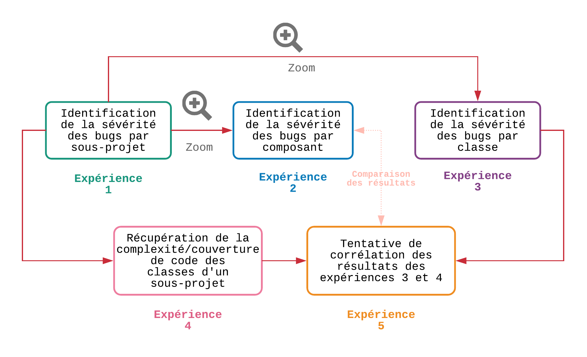
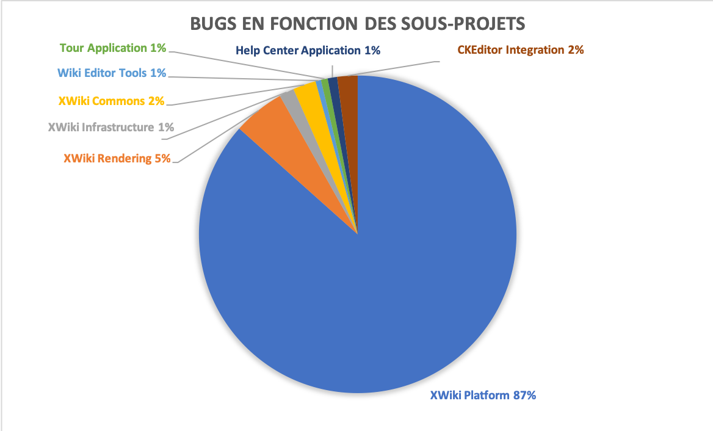
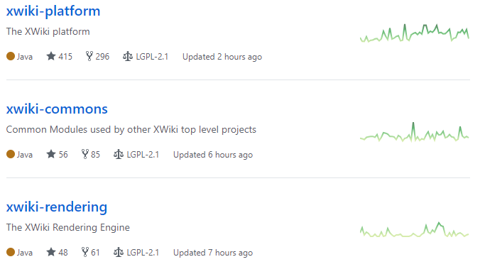
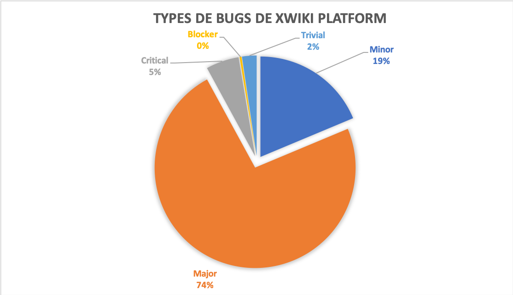
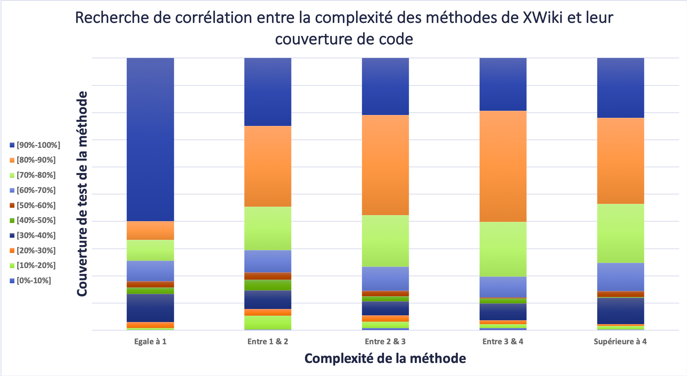

# Comment identifier les zones "sensibles" d'un projet Open Source ?

## Auteurs 

Nous sommes quatre étudiants en Master 2 d'Architecture logicielle : 

* Rudy Meersman &lt;rudy.meersman@etu.unice.fr&gt;
* Gaétan Duminy &lt;gaetan.duminy@etu.unice.fr&gt;
* Damien Fornali &lt;damien.fornali@etu.unice.fr&gt;
* Amandine Benza &lt;amandine.benza@etu.unice.fr&gt;

## Introduction

De nouvelles technologies émergent chaque jour. Les organisations, Open Source comme privées, produisent de plus en plus de systèmes qui utilisent une multitude de technologies, concepts et outils. 

Dans un tel contexte, de nouveaux problèmes apparaissent. Certaines de ces technologies \(comme HTML ou CSS\) ne sont pas forcément testables au sens où on l'entend \(tests unitaires, de non-régression...\) mais peuvent tout de même venir entraver l'expérience des utilisateurs du produit. De nombreuses questions sous-jacentes à ces problèmes émergent. Comment pouvons-nous identifier ces technologies, ces zones qui nécessitent plus d'attention afin d'accroître la qualité globale du projet ?

Ce document va présenter les résultats de nos recherches sur l'identification de zones "sensibles" d'un projet Open Source. Nous présenterons donc dans une première partie le contexte de notre recherche puis, dans un second temps, la démarche que nous avons suivie ainsi que les différents résultats obtenus.

## I. Contexte de la recherche

### 1.1. Pourquoi des projets Open Source ? 

À l'heure actuelle, les projets Open Source sont de plus en plus nombreux et populaires. De tels projets impliquent généralement des contraintes différentes et souvent plus "légères", que le développement d'un projet en entreprise. Cela n'impacte pas forcément pour autant la taille de ce genre de projets. En effet, il n'est pas rare qu'un projet Open Source grossisse énormément au fil du temps, tant au niveau de son code que de sa communauté.

Avec la croissance du nombre de contributeurs, on voit également apparaître une diversité de styles de développement. Cette croissance s’accompagnant de son lot de problèmes divers et variés, liés aussi bien au code des contributeurs qu'aux technologies utilisés, il est alors nécessaire d'être plus vigilant quant aux zones "sensibles" du code développé.

Dans ce contexte, la quantité et la qualité des tests sont des métriques primordiales. Ces tests sont nécessaires pour corriger ou éviter des erreurs pouvant survenir et peuvent ainsi permettre de faire avancer un projet plus rapidement. 

Cependant, dans un projet de grande envergure, il peut s’avérer difficile de tout tester. Des parties déjà considérées comme stables par les développeurs ne sont plus forcément mises à jour, or elles peuvent à terme devenir une source de problèmes.

C'est dans ce contexte que se situe notre étude. Nous allons analyser un projet Open Source de grande envergure, ici **XWiki**, et tenter d'identifier ses zones sensibles afin de mieux cibler les zones nécessitant plus d'attention. Ces résultats pourront, par exemple, nous fournir une piste possible afin d'améliorer la qualité des tests.  

### 1.2. Qu'est-ce que XWiki ?

_**XWiki**_ est un projet **Open Source** mature \(écrit majoritairement en ****Java\)**,** démarré en 2003**,** distribué selon les termes de la licence **GNU LGPL** et mettant l'accent sur l'extensibilité. Son objectif est de proposer une plateforme générique offrant des services d'exécution pour les applications construites sur cette plateforme.

Même si ce type de solution est très courante sur le net ou dans les intranet de sociétés, attention à ne pas le confondre avec le premier venu. Il se targue en effet d’être non seulement un “**Wiki d’entreprise**” mais aussi un “**Wiki Applicatif**” ce qui fait de lui bien plus qu’un simple outil de gestion d’articles.

_XWiki_ apporte une solution générique et configurable au client. Cela permet d'avoir un seul produit initial et de le décliner de diverses façon suivant les besoins du client. Cette solution va permettre aux clients de _XWiki_ \(typiquement une entreprise nécessitant de regrouper des informations\) d'obtenir sa propre base de connaissance structurée. _XWiki_ propose aussi une interface permettant à ses utilisateurs d'avoir en plus la possibilité de personnaliser les barres latérales de leur interface pour améliorer leur appréhension personnelle de l’outil.

Pour mettre en avant l'ampleur du projet, le code source de l'application possède plusieurs centaines de milliers de lignes, il existe plus de 750 extensions et son nombre d'installations actives est estimé à 4500.

## II. Approche initiale

### 2.1.  Hypothèse de départ 

Comme mentionné précédemment, notre objectif principal est ici de trouver une façon efficace et pertinente d'identifier les points sensibles d'un projet Open Source. Un point sensible étant, pour nous, un composant dont la panne/chute mettrait en péril le bon fonctionnement d'un projet.

Ainsi, plusieurs questions se posent. Nous pouvons, par exemple, nous demander où trouver les tests existants dans un tel projet. Si il existe une convention permettant de rapidement les différencier du reste du code. Nous pouvons également nous demander si il est réellement nécessaire de tout tester : certains composants, comme ceux écrit en CSS par exemple, nécessitent-ils autant de tests que d'autres ? Comment pouvons nous alors identifier les zones chaudes d'un code ?

De ces diverses questions découle la problématique à laquelle nous souhaitions essayer d'apporter une réponse dans ce chapitre : _**les zones chaudes d'un projet sont-elles celles qui causent le plus de problèmes ?**_  Une zone chaude étant ici un composant fortement sollicité lors d'une utilisation classique de _XWiki_.

En cherchant à valider cette hypothèse, nous pourrions ainsi tenter d'identifier les zones les plus sensibles d'un projet tel que _XWiki_.

### 2.2. Première méthodologie 

Afin de valider cette hypothèse, nous avons envisagé de mettre en place la méthodologie décrite ci-dessous. 

Tout d'abord, nous souhaitions identifier quelles parties de _XWiki_ sont les plus utilisées par des utilisateurs lambda, en récupérant par exemple des statistiques sur le nombre d'utilisations de certains composants. Cette première étape nous aurait permis de commencer à discerner des zones chaudes.

Ensuite, chaque membre de notre groupe aurait installé _XWiki_ puis suivi des cas d'utilisation prédéfinis. Par exemple en éditant certaines pages, en commentant des sections, etc...Nous aurions gardé des traces de nos parcours afin de comparer nos différentes utilisations. Ces traces nous auraient permis de distinguer les composants les plus utilisés lors d'une utilisation basique de _XWiki_.

Une fois cette étape complétée, nous aurions comparé les zones chaudes des utilisateurs type de _XWiki_ avec celles identifiées lors de notre propre cartographie. Nos utilisations étant plutôt basiques, il aurait été normal que certains composants n'apparaissent pas dans nos résultats mais soient visibles en récupérant des statistiques globales. En revanche, nous nous attendions à ce que les zones que nous aurions identifiées comme "chaudes" le soient aussi pour des utilisateurs lambdas de _XWiki_.

En dernier lieu, nous aurions essayé d'établir une corrélation entre les points chauds identifiés dans le code et les composants ayant le plus d'_issues_ critiques.

Malheureusement, plusieurs imprévus ont entravé la mise en œuvre de cette méthodologie.

Tout d'abord, nous avons rencontré une impossibilité à identifier les "points chauds" des utilisateurs lambdas. En effet, le cœur de _XWiki_ étant composé d’un bundle d’extension, il n’y a malheureusement aucun moyen de savoir quelles parties sont les plus utilisées par l’utilisateur moyen. Faire une carte de chaleur à la main perd alors de son intérêt : en procédant uniquement de cette façon et en utilisant uniquement les données récupérées de nos propre parcours, nous ne serions capable de ne collecter qu’une faible quantité de données. Celles-ci seraient biaisées et peu représentatives car nos utilisations de _XWiki_ ne seraient pas exhaustives.

Nous avons donc finalement décidé de choisir une nouvelle méthodologie sur laquelle nous appuyer, celle-ci n'étant pas adaptée à notre étude et ne fournissant pas de résultats significatifs. 

En revanche, dans le cas d'une étude sur les extensions additionnelles de _XWiki_, une telle méthodologie pourrait être adaptée. En effet, contrairement au cœur de _XWiki_, il est possible de savoir quelles extensions sont les plus utilisées, en se basant sur leur nombre de téléchargements. Ainsi, se baser sur ces informations et des informations récoltées à la main pourrait être intéressant si nous choisissions d'étendre le sujet de cette étude au delà du cœur de _XWiki_.

## III. Nouvel objectif 

Comme mentionné plus tôt, il n'est pas possible de savoir de façon précise quels composants sont les plus sollicités par les utilisateurs de _XWiki_. Ainsi, étant donné que notre première hypothèse reposait sur cette métrique, il a été nécessaire d'en trouver une nouvelle. 

Nous nous sommes donc penchés sur l'hypothèse suivante : _**dans un projet Open Source, une zone sensible est-elle forcément une zone dont la couverture de code est importante ?**_

Avec cette seconde approche, nous avons mis en place une nouvelle méthodologie expérimentale :

1. Tout d'abord, partir du projet complet, ici _XWiki_, et déterminer, parmi les plus gros sous-projets, ceux ayant le plus de **bugs** non résolus. _XWiki_ propose de nombreuses extensions, de ce fait, nous ne pouvons malheureusement pas toutes les étudier dans le cadre de cette étude. Nous avons donc cherché à restreindre notre **scope** de recherche sur un ou plusieurs sous-projets.
2. Ensuite, afin que l'étude soit la plus représentative possible, identifier le sous-projet le plus populaire grâce au nombre de participations sur celui-ci ainsi que son nombre de branches actuelles afin de localiser les bugs ayant le plus de chance d'entraver l’expérience utilisateur. 
3. Une fois le sous-projet choisi, définir la **sévérité** des bugs des composants présentant le plus d'issues.
4. Parmi ces composants, identifier, cette fois, les **classes** associées à ces issues.   
5. Indépendamment des points deux, trois et quatre, se baser sur le sous-projet identifié dans le second point. Récupérer la **complexité** ainsi que la **couverture** de code de chacune des classes de ce sous-projet.
6. Essayer d'établir une corrélation entre les classes identifiées dans le quatrième point et leur complexité et couverture de code.

Cette nouvelle approche va nous permettre de valider ou invalider l'hypothèse précédente, qui elle même propose une piste à la résolution de notre question globale.

## IV. Recherches et expérimentations

### 4.1. Collecte d'informations 

**Sources**

Afin de collecter des données nécessaires à la réalisation de notre méthodologie nous avons utilisé différentes sources.

* **Github**

_Github_ est l'hôte des sources de _XWiki_. Il nous a notamment permis d'avoir une meilleure vue de l'architecture globale du projet et d'ainsi définir le sous-projet \(repository\) sur lequel nous concentrer. 

* **Jira**

_Jira_ est le système de tickets utilisé par _XWiki_. Il nous a permis de parcourir les tickets levés par l'équipe de développement et de récupérer les bugs associés. _Jira_ nous a également permis de récupérer la sévérité de chacun des bugs ainsi que leur emplacement dans le code. 

* **Clover**

_XWiki_ utilise _Clover_ afin d'obtenir de nombreuses informations quant à la qualité de son code. Il s'agit donc de notre source principale de métriques, comme par exemple la _complexité_ et _couverture de code_. Par ailleurs, _Clover_ stocke les rapports générés. Ceux-ci étant disponibles au public, nous avons pu les utiliser dans nos expériences. 

* **Jenkins**

_Jenkins_ nous permet de relier le code source \(_Github_\) aux problèmes relevés \(_Jira_\). Cependant il ne stocke que les informations des 20 derniers builds générés. 

**Métriques**

Ayant fait évoluer notre direction au cours du projet, nous avons également fait évoluer nos métriques. De ce fait, nous les avons choisies en fonction à la fois des données initialement collectées, mais aussi, en fonction de celles récupérées lors de l'application de notre nouvelle démarche.

Afin que nos expériences puissent être claires pour les lecteurs, nous définissons ici les métriques utilisées.

#### **Métriques de couverture de code**

Nos expériences introduisent la notion de couverture de code. Cette notion est composite et pour obtenir la couverture globale, une fonction est appliquée sur les trois métriques suivantes.

* _Couverture de branche._ 

Cette métrique mesure quelles branches possibles dans les structures de contrôle de flux sont suivies. Sur _Clover_, elle est obtenue en enregistrant si l'expression booléenne dans la structure de contrôle a été évaluée à la fois à vraie et à la fois fausse pendant l'exécution.

* _Couverture d'instruction_

La couverture d'instruction est une métrique mesurant quelles instructions d'un corps de code ont été exécutées au cours d'un test, et quelles instructions ne l'ont pas été.

* _Couverture de méthode_

La couverture de méthode est une métrique mesurant si une méthode a été accédée pendant l'exécution d'un programme.

#### **Métriques de complexité de code**

Nous utilisons également la notion de complexité d'un code.

* _Complexité_

Il s'agit de la métrique globale donnant la complexité cyclomatique d'une entité dans un contexte donné. Les contextes possibles étant une _classe_, un _package_ ou encore un _projet_.

* _Complexité d'une méthode_

C'est une métrique calculée de manière arbitraire, par exemple, sur _Clover_ le calcul est effectué de la façon suivante:

1. _`Méthode vide: 1 point`_
2. _`Instruction unique: 0 point`_
3. _`Bloc Switch: (nombre de Case) points`_
4. _`Bloc Try Catch: (nombre de Catch) points`_ 
5. _`Expression Ternaire: 1 point`_
6. _`Expression Booléenne: (nombre de && ou ||) points`_

#### **Autres métriques**

* _Sévérité_

Il s'agit de la classification d'issues intitulé "_priorité"_ dans Jira. Par exemple, pour notre étude, un bug majeur sera plus _sévère_ qu'un bug mineur.

### 4.2.  Expériences sur XWiki 

En suivant la méthodologie présentée plus tôt, nous pouvons discerner cinq expérimentations distinctes.

Vous trouverez ci-dessous un schéma résumant notre démarche.

### 4.2.1. Expériences 1-2-3 

Les trois premières expériences vont consister à de plus en plus réduire le scope de nos recherches : nous allons initialement nous baser sur un projet complet, puis sur un sous-projet, puis sur certains de ses composants et ainsi de suite. Dans ce cas, il s'agit de récupérer les données sur Jira afin de pouvoir les exploiter.

Pour **la première de nos expériences**, nous allons pouvoir récupérer, sur les 1000 derniers bugs recensés, leurs propriétés allant de leurs emplacements à leurs descriptions ainsi que la priorité de ceux-ci. Cette expérience va ainsi nous fournir une première piste à exploiter. 

Pour la **seconde**, nous allons exploiter les résultats obtenus plus tôt afin de cibler les composants les plus touchés par les bugs. On récupère ensuite les bugs de ces composants et regardons leurs différentes sévérités afin de pouvoir créer les premières métriques utilisables pour notre hypothèse.

Enfin, pour **la troisième expérience**, nous zoomons une dernière fois. Cette fois-ci, nous allons nous pencher sur des classes comportant des bugs référencés sur Jenkins. Cependant, ne pouvant récupérer que les données des vingt derniers builds,  nous avons décidé de ne pas zoomer sur des composants en particulier. En effet, la plage de données récupérée étant déjà faible, nous n'avons pas voulu la réduire plus que nécessaire. 

Au terme de ces **trois expériences**, nous nous attendons à ce que la plupart des classes obtenues dans l'**expérience trois** soient présentes dans les composants identifiés dans l'**expérience deux**. 

### 4.2.2. Expérience 4 

La **quatrième expérience** va consister à repartir du sous-projet identifié dans la **première expérience**, puis à récupérer la complexité et la couverture de code de chacune des classes dudit sous-projet. Pour cela, on va notamment pouvoir utiliser les données fournies par _Clover_. 

Nous allons récupérer les données de couverture de code afin d'avoir des données aux valeurs plus lisibles, et surtout plus exploitables, que celles présentes sur le site.

### 4.2.3. Expérience 5 

Finalement, cette **cinquième et dernière expérience** va consister à mettre en relation les résultats des **expériences trois et quatre**. 

Nous allons utiliser les résultats obtenus lors des **expériences trois et quatre** afin de tenter d'établir une corrélation entre les classes comportant le plus de bugs et leur couverture de code/complexité. 

## V. Analyse de nos résultats

Nous présentons dans cette partie les résultats de nos différentes expériences.

### 5.1. Expériences 1-2-3 

* _**Expérience 1**_ 

Les données recueillies lors de cette expérience sont réparties par sous-projet. Elles indiquent le nombre actifs de bugs relevés lors de notre étude. Vous trouverez ci-dessous un  schéma retranscrivant nos résultats. 

On remarque, sur la figure ci-dessus, que la majorité des bugs actifs semble liée au sous-projet _XWiki_ _Platform_. Nous pouvons également noter qu'une proportion non négligeable des bugs n'étant pas situés dans _XWiki_ _Platform_ se trouvent dans les deux sous-projets _XWiki_ _Rendering_ et _XWiki_ _Commons_. Il pourrait donc être intéressant d'analyser chacun de ces sous-projets.

Cependant, comme indiqué plus haut, nous avons fait le choix de ne traiter qu'un seul sous-projet dans le cadre de cette étude.

Comme nous pouvons le voir sur la _`Figure 3`_, _XWiki_ _Platform_ semble être de loin le sous-projet le plus populaire et important parmi ceux mentionnés plus haut. Étant également celui comportant le plus de bugs, nous nous sommes naturellement tournés vers celui-ci afin d'effectuer notre étude. 

Vous trouverez ci-dessous sur la _`Figure 4`_  les types de bugs qui composent _XWiki Platform._

Grâce à la _`Figure 4`_, nous pouvons noter qu'une grande partie des bugs présents dans _XWiki Platform_ sont majeurs. Des bugs majeurs pouvant donc indiquer l'apparition d’éléments bloquants venant entraver l'expérience utilisateur. Identifier la provenance de ces bugs pourraient donc nous aider à identifier les zones sensibles du sous-projet _XWiki Platform_. 

* _**Expérience 2**_

Suite aux résultats obtenus dans l'**expérience 1**, nous avons analysé les bugs des composants du sous-projet _XWiki_ _Platform_. Voici, ci-dessous, les résultats que nous obtenons

Dans une première approche de ces données, nous pourrions identifier les composants **OldCore**, **Web** et **WYSWIG** comme ceux posant le plus de problèmes. En effet, en étudiant la _`Figure 5`_,  nous pouvons constater que ce sont ceux présentant le plus de bugs dans la ligne _"Total"_  \(803 pour **OldCore**, 948 pour **Web**, etc...\).

Cependant, le nombre de bugs d'un composant n'est ici que le premier critère que nous avons décidé de prendre en compte. En effet, nous avons également fait le choix d'utiliser la sévérité des bugs comme critère. 

Grâce à ces deux métriques, nous en avons créé une nouvelle : l'indice de sensibilité. Celui-ci a été calculé à partir des critères précédents et permet de prendre en compte plusieurs métriques de façon simultanée. Ainsi grâce à ce nouvel indice, on peut revenir sur nos résultat précédents et constater que les composants posant problème ont changé. On a donc on première position le composant **Wiki** \(en doré sur la _`Figure 5`_\), ensuite le composant **Notifications** \(en argent sur la _`Figure 5`_\) et enfin le composant **OldCore** \(en bronze sur la _`Figure 5`_\).

Ce sont les composants au fort indice de sensibilité que nous avons pris en compte pour la suite de ces expériences.  

La _`Figure 6`_ ci-dessus nous permet de visualiser de façon plus claire les composants affichés en fonction de leur indice de sensibilité.  

* _**Expérience 3**_ 

Cette étape étant principalement une étape de collecte de données, nous n'avons pas de résultats à présenter ici. En effet, ceux-ci n'avaient pas pour but d'être analysés de façon brute mais d'être utilisés par la suite. 

Dans cette expérience, nous collectons donc les données relatives aux 20 derniers builds sur chaque branche de _XWiki_ _Platform_ proposés sur Jenkins.

### 5.2. Expérience 4 

L'objectif principal de cette expérience est de récupérer la complexité ainsi que la couverture de code des classes de _XWiki_ _Platform_ sous une forme exploitable. 

Tout comme **l'expérience trois**, il s'agit principalement d'une collecte de données menant à **l'expérience cinq.** Cependant, avec ces dernières nous avons tout de même tenté d'établir une corrélation entre complexité et couverture de code.

En étudiant la _`Figure 7`_,  on dénote une importante couverture de code pour les méthodes de complexité faible. Cependant, les couvertures étant réparties de manière équivalente pour des méthodes plus complexes, il nous est difficile de tirer une conclusion en nous basant uniquement sur cette expérience.

### 5.3. Expérience 5

Cette étape est la plus importante car elle cherche à mettre en relation les résultats obtenus lors des expériences précédentes.

Les données récoltées grâce à l'**expérience 3** nous ont permis de récupérer les classes posant problème ainsi que les composants auxquels elles appartiennent. Nous avons donc regroupé ces dernières en fonction de leur composant d'origine afin d'obtenir des résultats plus représentatifs que si nous nous focalisions uniquement sur des classes. 

Cette répartition nous permet d'obtenir la _`Figure 8`_ se trouvant ci-dessous.

La _`Figure 8`_ présente la répartition des bugs pour les composants identifiés après que nos différentes classes aient été regroupées. 

Ainsi, en partant d'une approche différente nous obtenons des résultats semblables. Notre approche par composants dans l'expérience 2 nous avait permis d'identifier **OldCore** comme un des composants les plus sensibles de _XWiki Platform_., son indice de sensibilité étant d'environ 20%. 

De la même façon, nous distinguons sur la _`Figure 8`_ qu'il s'agit d'un composant dont le nombre de bugs est beaucoup plus important que la moyenne. Nos données venant cette fois d'une approche différente \(en se basant sur des classes\), nous pouvons confirmer que notre indice de sensibilité est une métrique fiable pour les expériences effectuées.

La _`Figure 9`_ se trouvant ci-dessus répertorie le nombre de bugs, la couverture de code et la complexité estimée par composant. Nous remarquons que le composant **OldCore** a une couverture de code parmi les plus **faibles** \(~60%, la moyenne étant de 77.6%\).

**D'après ces résultats nous pouvons donc infirmer notre hypothèse**. 

Nous nous attentions initialement à ce que des zones plus sensibles soient plus couvertes que d'autres de par leur propension à causer plus d'erreurs et à pouvoir mettre en péril le fonctionnement du projet. Cependant, nos analyses des données récoltées montrent que l'inverse à tendance à se produire et que les couvertures des composants les plus sensibles apparaissent plus faibles.

## VI. Conclusion 

Au terme de cette étude, nous ne pouvons malheureusement pas confirmer ou infirmer notre hypothèse de façon certaine.

Notre approche initiale, consistant à identifier les zones "chaudes" du code, a très vite rencontré des limites nous empêchant d'aller au bout de cette idée.

Notre seconde hypothèse, quant à elle, proposait d'établir un lien entre zone sensible et couverture de code. Son but, à terme, étant de proposer aux développeurs de XWiki une manière d'identifier facilement les zones à risque pour éviter les erreurs plus facilement. Notre hypothèse était donc la suivante : _dans un projet Open Source, une zone sensible est-elle forcément une zone dont la couverture de code est importante_ ?

Suite aux résultats obtenus pour l'expérience finale de cette seconde approche, nous avons invalidé cette hypothèse. En effet, il est apparu que les zones que nous avons identifiées comme "sensibles" peuvent être bien moins couvertes que des zones ne l'étant pas.

Cette approche nous a tout de même permis d'identifier des zones à risques, malgré le fait que notre hypothèse soit invalidée. En effet, nous pensions que les développeurs auraient plus tendance à surveiller les parties de code pouvant poser problème et que les zones sensibles connues seraient donc bien couvertes. Nos résultats nous ont prouvés le contraire et montrent que de nombreux tests sont nécessaires pour certains composants pouvant poser problème.

Toutefois, notre étude étant fortement restreinte, l'infirmation de cette hypothèse et nos résultats comportent beaucoup de limites.

En effet, nos résultats ne reposent que sur un unique sous-projet d'un seul projet Open Source. De plus, les données collectées sur ce sous-projet sont très limitées, si ce n'est biaisées, puisqu'elles sont constituées des vingt derniers builds réalisés à la date de cette étude.

D'autre part, notre méthodologie n'est pas infaillible, les expériences réalisées pouvant présenter des erreurs. Par exemple, la réalisation de nos scripts d'analyse de données peuvent comporter des inexactitudes, comme l'oubli de certaines données ou un filtrage incomplet de ces dernières.

De plus, certains choix arbitraires que nous avons fait sont de plus discutables. Par exemple, le fait de considérer que 60% représente un taux de couverture de code faible est sujet à débat.

Ainsi, cette étude n'est donc pas une conclusion en soit mais plutôt une porte ouverte à l'élaboration d'études similaires sur des données plus représentatives.

## VI. Références

* Les [sources](https://github.com/xwiki/xwiki-platform) _Github_ du projet.
* Le topics utilisés sur le forum _XWiki_ pour communiquer avec les développeurs:
  * [Topic 1](https://forum.xwiki.org/t/student-what-are-the-hot-spots-of-xwiki-code/4213/2)
  * [Topic 2](https://forum.xwiki.org/t/student-issues-code-linking/4329)
* Les données [Jenkins](https://ci.xwiki.org/blue/organizations/jenkins/XWiki%2Fxwiki-platform/branches/) permettant de collecter les informations relatives aux 20 derniers builds sur XWiki Platform.
* Les données [Clover](http://maven.xwiki.org/site/clover/20190202/clover-commons+rendering+platform-20190202-0222/dashboard.html) permettant de lier _Jira_ et _Github_.
* Le tableau d'ensemble listant tous les serveurs composant l'écosystème [_XWiki_](https://dev.xwiki.org/xwiki/bin/view/Community/DevelopmentPractices#HGeneralDevelopmentFlow).
* Le [système](https://jira.xwiki.org/secure/Dashboard.jspa) de tickets utilisé par _XWiki_.
* Les [extensions](https://extensions.xwiki.org/xwiki/bin/view/Main/WebHome) _XWiki_.

