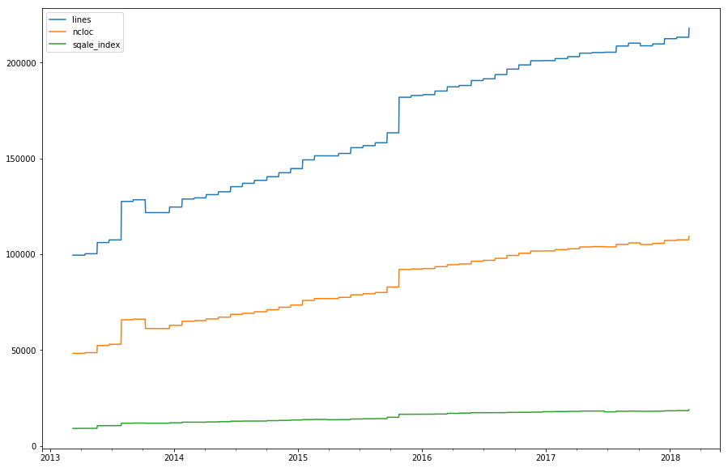
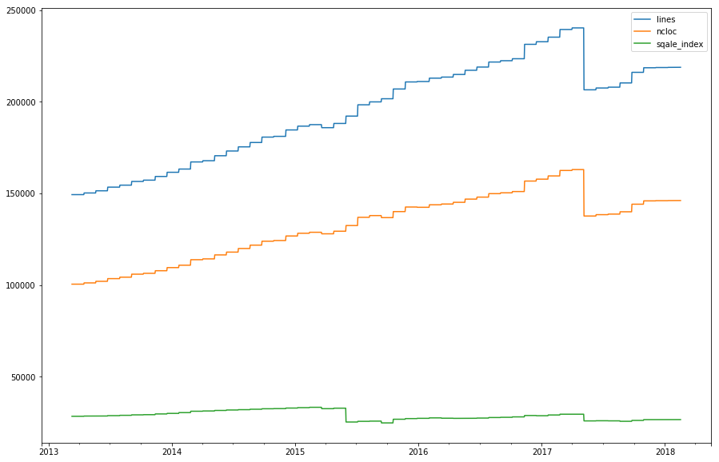
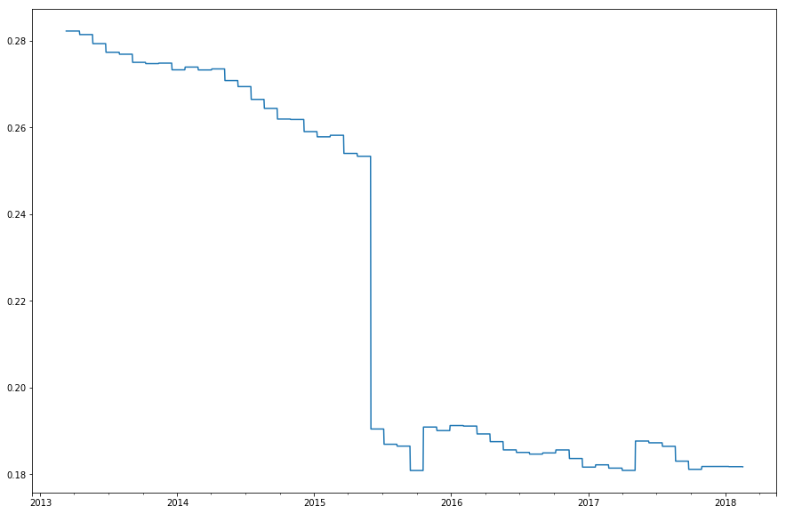
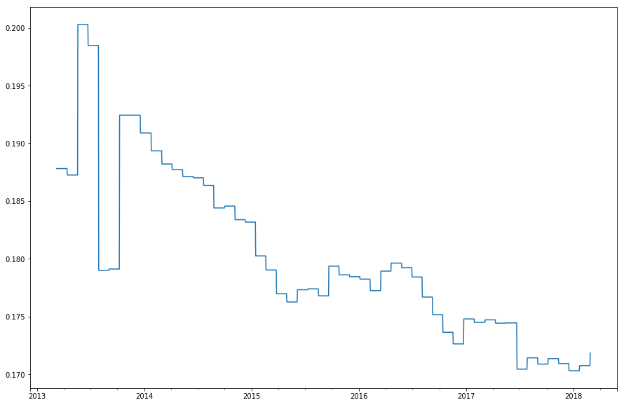
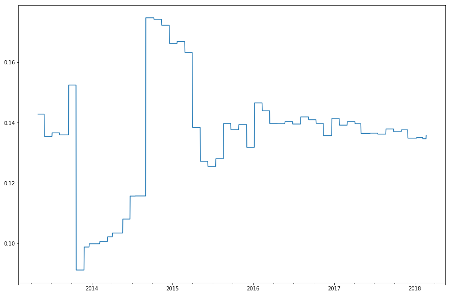
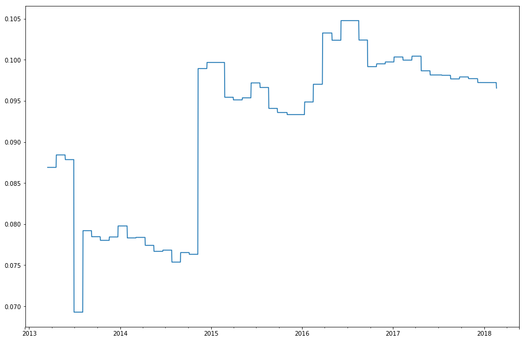

# Comment est organisé le développement d'un projet Open Source de Machine Learning ?

_Février 2018_

## Auteurs

Nous sommes quatre étudiants en dernier année à Polytech Nice-Sophia Antipolis, spécialisés en Architecture Logicielle.

* Robin Alonzo &lt;alonzo.robin@etu.unice.fr&gt;
* Antoine Aubé &lt;aube.antoine@etu.unice.fr&gt;
* Thierno Balde &lt;balde.thierno@etu.unice.fr&gt;
* Mathieu Mérino &lt;merino.mathieu@etu.unice.fr&gt;

## Introduction

Ce chapitre présente le travail de recherche produit par notre groupe dans le cadre de la matière Rétro-Ingénierie, Maintenance et Évolution des Logiciels \(RIMÉL\). Nous présenterons successivement notre contexte de recherche, la question que nous avons posé accompagnée de nos hypothèses, puis la démarche à laquelle nous avons procédé ; nous poursuivrons par une analyse des résultats obtenus en faisant le lien avec nos hypothèses, puis concluerons.

## I. Contexte : Apprentissage Automatique, une communauté grandissante

L'**apprentissage automatique** \(Machine Learning, ML\) est une science sous-jacente à l'intelligence artificielle qui définit des méthodes pour prédire des caractéristiques à partir d'un ensemble de données.

Cette discipline ne cesse d'intéresser de nouveaux adeptes, autant les entreprises qui souhaitent exploiter les très grands volumes de données qu'elles génèrent, que les chercheurs qui ne cessent de publier de nouveaux travaux à ce sujet.

_Figure 1 - Intérêt croissant pour le Machine Learning lors des cinq dernières années_

_Source des données : _[_Google Trends_](https://trends.google.fr/trends/explore?date=today 5-y&q=machine learning,deep learning,artificial intelligence)

Une brève investigation révèle qu'une communauté s'est créée autour de l'apprentissage automatique, autant pour diffuser le savoir \(des sites comme _DataCamp_\), pour collaborer autour d'ensemble de données publics \(_Kaggle_\) ou pour construire des logiciels et bibliothèques qui tiennent compte de l'avancée dans le domaine \(de nombreux projets open source sur _GitHub_ comme _scikit-learn_, ...\).

## II. Questionnement

### II.1. Observations et question générale

L'apprentissage automatique est un domaine de pointe, que nous imaginons encore très proche de la recherche. Nous nous étonnons que, pourtant, les outils récurrents du Machine Learning \(nous entendons souvent parler de _Tensorflow_ et ses surcouches, _numpy_, ...\) soient des logiciels Open Source.

Dans ces conditions, nous nous demandons comment est organisé le développement d'un projet open source de Machine Learning. À l'échelle d'un projet, de la réponse à cette question dépend la confiance que nous pouvons mettre en la qualité de leurs algorithmes et donc, d'une certaine manière, diriger notre choix quand nous en aurons besoin. Au niveau global, nous souhaitons déterminer s'ils existe des schémas récurrents dans l'ensemble de ces projets.

### II.2. Sous-questions

Notre intuition suggère plusieurs pistes que nous souhaitons explorer et auxquels nous nous restreindrons dans cette étude. Leur formulation ci-suit concerne bien les projets Open Source de Machine Learning :

1. **Ces projets sont-ils menés par des chercheurs ?**
2. **Qui écrit les algorithmes d'apprentissage automatiques dans ces projets ?**
3. **La qualité logicielle est-elle une préoccupation de ces projets ?**

### II.3. Objet de l'étude

Comme nous souhaitons observer des propriétés vraies pour les projets Open Source de Machine Learning en général, l'étude portera sur un ensemble de projets.

Nos critères de sélection sont arbitraires, ils nous permettent de ne pas nous disperser dans les outils d'analyse que nous produisons. Les critères sont les suivants :

* Ces projets sont des bibliothèques d'algorithmes d'apprentissage automatique.
* Ces projets sont écrits en majorité en Python. Python est en effet l'un des langages de prédilection dans ce domaine.
* Ces projets sont hébergés sur GitHub.

## III. Rassemblement d'informations

### III.1. Outils utilisés

Pour rassembler les informations utilisés dans cette étude, nous avons utilisé les outils suivants :

* [RepoDriller](https://github.com/mauricioaniche/repodriller) pour analyser les contributions successives des projets.
* [SonarQube](https://www.sonarqube.org/) pour analyser la qualité des projets.

Nous avons également produit une série de scripts Bash, Javascript et Python pour des tâches plus spécifiques et pour automatiser la récolte des informations, afin d'améliorer la reproductibilité de l'étude et de repérer les possibles erreurs dans le protocole que nous suivons.

Nous utilisons également des bibliothèques comme [scholarly](https://github.com/percolator/scholarly), qui nous permettent d'écrire des outils plus simples pour récolter nos données.

Les figures présentes dans le document ont été produites par nos soins, la plupart avec la bibliothèque [Pygal](http://pygal.org/en/stable/).

### III.2. Projets retenus

Nous avons retenu trente-quatre projets qui respectent nos critères.

Les projets que nous avons sélectionné ont été trouvés sur la liste [Awesome Machine Learning](https://github.com/josephmisiti/awesome-machine-learning).

Ils sont au nombre de trente-quatre : _scikit-learn_, _theano_, _keras_, _scikit-image_, _simplecv_, _nltk_, _pattern_, _auto-ml_, _pylearn_, _pybrain_, _brainstorm_, _pyevolve_, _pytorch_, _cogitare_, _featureforge_, _metric-learn_, _simpleai_, _astroML_, _lasagne_, _hebel_, _chainer_, _prophet_, _gensim_, _surprise_, _crab_, _nilearn_, _pyhsmm_, _skll_, _spearmint_, _deap_, _mlxtend_, _tpot_, _pgmpy_ et _milk_.

Ces projets sont différents entre eux notamment au niveau des domaines auxquels ils sont dédiés \(certains sont généralistes, d'autres spécifiques à un domaine\) ainsi que de leur maturité \(en terme de nombre de contributions, nombre de contributeurs\).

_Figure 2 - Grandes disparités de la maturité des projets étudiés_

Nous observerons néanmoins que ces projets très actifs pour la plupart. La _Figure 3_ présente la fonction de répartition cumulative \(Cumulative Distribution Function - CDF\) des contributions apportés aux projets en 2017 et montre que, nonobstant de rares projets qui n'évoluent plus ou très peu, les projets évoluent en continu dans l'année \(la plupart des courbes sont approximativement linéaires\).

_Figure 3 - Évolution perpétuelle de la plupart des projets_

Nous pensons que cette diversité apparente entre les projets nous permettra d'obtenir des résultats moins biaisés, et donc nous faisons l'hypothèse que les résultats obtenus sur cet échantillon de projets Open Source de Machine Learning seront généralisables à tous les projets similaires. Le fait qu'ils soient en changement perpétuel donne son intérêt à l'étude qui s'intéresse à l'évolution des projets.

## IV. Hypothèses et expériences

Nous avons décomposé notre question générale en sous-questions qui fixent les limites que nous souhaitons étudier. Dans cette partie, nous détaillons pour chaque sous-questions nos hypothèses et la méthode que nous allons employer pour les vérifier ou les invalider.

Notre hypothèse de travail commune à l'ensemble de l'étude est que les contributeurs sont de bonne foi :

* Ils sont auteurs du code qu'ils ont mis en ligne.
* Le nom, prénom et l'adresse mail spécifiés dans les contributions leur appartiennent.

### IV.1. Ces projets sont-ils menés par des chercheurs ?

Nous avons l'intuition que les projets de Machine Learning sont le fruit du travail des chercheurs, soit parce qu'ils sont des réalisations produites à l'aboutissement de leurs travaux, soit parce qu'ils sont les mieux à même de contribuer sur ces projets.

Nous souhaitons évaluer trois hypothèses :

1. **Les contributeurs sont majoritairement des chercheurs.**
2. **Les contributions viennent majoritairement de chercheurs.**
3. **Les chercheurs contribuent plus individuellement que les autres contributeurs.**

Chaque hypothèse traite une façon de représenter l'importance des chercheurs dans ces projets : en nombre de contributeurs, en nombre de contributions, en qualité de maintenance. Si les chercheurs sont significativement importants pour la tenue du projet, nous estimons raisonnable de conclure que ces projets sont le fruit du travail des chercheurs.

Pour répondre à ces trois hypothèses, nous avons récolté des informations pour chaque _commit_ de chaque dépôt : auteur \(nom et adresse mail\), nombre de fichiers modifiés, lignes ajoutées et retirées. Pour cette question, nous avons étudié l'ensemble des projets sélectionnés.

Dans un premier temps, il convient de définir comment nous avons déterminé qu'un contributeur est un chercheur.

#### Comment reconnaître un contributeur-chercheur ?

Il s'agit dans un premier temps de lister les contributeurs des projets étudiés \(par le nom\), puis pour chacun lister les adresses mail qu'il a utilisé.

Nous avons développé deux approches qui chacune fournit des résultats partiels :

* **Un chercheur possède une adresse mail dont le domaine appartient à une académie ou à un établissement de recherche. **Cette approche présente comme biais de potentiellement considérer comme chercheur un étudiant universitaire. Elle est très peu exhaustive car la majorité des utilisateurs contribuent avec une adresse _@gmail_ de laquelle nous ne pouvons pas conclure.
* **Un chercheur possède un profil de chercheur sur Google Scholar.** Cette approche a comme désavantage la non-complétude de Google Scholar, qui ne contient pas tous les articles de recherche et qui ne crée pas systématiquement un profil pour chaque chercheur.

Chaque approche détermine si, oui ou non, un contributeur est un chercheur à son sens \(pas de position intermédiaire\).

En définitive, nous considérons qu'un contributeur est un chercheur si au moins une des approches conclut qu'il en est un.

#### IV.1.1. _Les contributeurs sont majoritairement des chercheurs._

Il s'agit d'étudier l'implication des chercheurs dans le développement d'un projet Open Source de Machine Learning vis-à-vis de leur nombre proportionnellement au nombre de contributeurs total.

Nous considérons que cette hypothèse serait réfutée si la part des chercheurs dans l'ensemble des contributeurs représentait moins de 50%.

Nous procéderons en étudiant la proportion de chercheurs dans les contributeurs de chaque projet.

#### IV.1.2. _Les contributions viennent majoritairement de chercheurs._

Contrairement au paragraphe précédent, nous étudierons ici l'implication des chercheurs vis-à-vis de leur nombre de contributions.

Nous considérons que cette hypothèse serait réfutée si la part des chercheurs dans l'ensemble des contributions, en termes de _commits_ ou de lignes de codes modifiées, représentait moins de 50%.

Nous procéderons en étudiant la répartition des _commits_ et des lignes modifiées entre les chercheurs et les non-chercheurs de chaque projet.

#### IV.1.3. _Les chercheurs contribuent plus individuellement que les autres contributeurs._

Il s'agit ici d'étudier l'investissement de chaque contributeurs-chercheurs dans le développement comparé aux autres contributeurs. \(Contribuent-ils plus ou moins que les autres?\)

Nous considérons que cette hypothèse serait réfutée si, en termes de _commits_ ou de lignes de code modifiées, la majorité des contributeurs-chercheurs s'investit moins que les autres contributeurs.

La contribution en termes de _commits_ serait plutôt un indicateur de contribution sur le long terme tandis que la contribution en termes de lignes de code modifiées indiquerait l'appartenance du projet au contributeur.

Nous procéderons en étudiant les statistiques individuelles \(moyenne, quartiles\) des chercheurs et non-chercheurs de chaque projet.

### IV.2. **Qui écrit les algorithmes d'apprentissage automatique dans ces projets ?**

Nous avons l'intuition que les algorithmes de Machine Learning demandent une expertise pour en comprendre les mécaniques, et donc donc que chaque algorithme est maintenu surtout par un seul contributeur, expert de cet algorithme. Dans l'autre sens, nous pensons que l'apprentissage automatique est un domaine très vaste et qu'il est peu probable qu'un expert d'un algorithme possède une expertise équivalente dans d'autres algorithmes.

Nous souhaitons évaluer les hypothèses suivantes :

1. **La majorité des algorithmes sont maintenus par un contributeur majeur.**
2. **Un contributeur majeur d'un algorithme n'est contributeur majeur que de cet algorithme.**

L'intérêt de cette question et de ces hypothèses est liée aux conclusions de l'équipe de Xavier Blanc qui indiquent qu'un morceau de logiciel \(pour nous, un algorithme\) présente moins d'erreur s'il est écrit par un petit nombre de contributeurs fortement investis dans cet algorithme \[1\].

Il convient avant de poursuivre de préciser notre définition d'un contributeur majeur. Il s'agit pour nous d'un contributeur qui détient au moins 50% du code d'un algorithme dans la version la plus récente du projet. Cette définition présente un biais car un contributeur unique a tout à fait pu produire un algorithme entièrement mais par des modifications successives et non fonctionnelles \(formatage du code pour suivre une convention, ...\), il peut être considéré comme contributeur non-majeur de cet algorithme.

#### Comment reconnaître un algorithme ?

Reconnaître un algorithme d'apprentissage automatique dans un projet est un problème difficile, sa résolution dépend du projet que nous étudions.

Connaissant cette difficulté, nous avons restreint cette partie de l'étude à trois projets : _scikit-learn_, _scikit-image_ et _nltk_.

Dans ces projets, nous observons que chaque algorithme est isolé dans son fichier, ce qui va nous simplifier l'étude du code ownership \(nous la ferons à l'échelle du fichier, sans découper dans le fichier les lignes qui nous intéressent\).

Ci-suivent les critères que nous avons retenu pour chaque projet pour déterminer qu'un fichier est un "fichier-algorithme". IL faut que tous les critères soient validés pour qu'un fichier soit retenu.

##### Critères pour _scikit-learn_

* Le fichier a pour extension ".py" ou ".pyx".
* Le fichier est dans un dossier dont l'arborescence débute par "sklearn".
* Le fichier contient "def fit\(self". Il s'agit d'un morceau du prototype de la fonction qui entraîne un modèle sur un ensemble de données, elle est commune à tous les algorithmes de _scikit-learn_. Seul le début du prototype nous paraît sûr d'être recherché car la suite peut présenter des variations avec les espaces, ...

##### Critères pour scikit-image

* Le fichier a pour extension ".py" ou ".pyx".
* Le fichier est dans un dossier dont l'arborescence débute par "skimage".
* Le fichier n'a pas de dossier "util", "scripts" ou "utils" dans son arborescence.
* Le nom du fichier ne commence pas par "\_".
* Le nom du fichier n'est pas "setup.py" ou "util.py".

##### Critère pour nltk

* Le fichier a pour extension ".py" ou ".pyx".
* Le fichier est dans un dossier dont l'arborescence débute par "nltk".
* Le fichier est dans un dossier qui contient un fichier "api.py".
* Le nom du fichier ne commence pas par "\_".
* Le nom du fichier n'est pas "api.py", "setup.py" ou "util.py".

#### IV.2.1. _Une majorité d'algorithmes sont maintenus par un contributeur majeur._

Nous allons lister les algorithmes qui sont maintenus par un contributeur majeur et comparer leur nombre au nombre d'algorithmes du projet.

L'hypothèse est réfutée si moins de 50% des algorithmes sont maintenus par un contributeur majeur.

#### IV.2.2. _Un contributeur majeur d'un algorithme n'est contributeur majeur que de cet algorithme._

Nous allons reprendre la liste des algorithmes maintenus par un contributeur majeur et rassembler les algorithmes par nom d'auteur.

L'hypothèse est réfutée s'il existe au moins un auteur qui est contributeur majeur sur au moins deux algorithmes.

### IV.3. **La qualité logicielle est-elle une préoccupation de ces projets ?**

La qualité logicielle est synonyme de santé du projet ; la maintenabilité et l'extensibilité sur le long terme en dépendent. Nous mesurons cette caractéristiques à travers la dette technique ; cette dernière est une métaphore des fautes de conception et d'écriture du code \(duplication, gestion des exceptions, mauvaise utilisation des patrons de conception, ...\) qui s'accumulent au cours de la vie d'un projet, le rendant plus difficile la maintenance et l'évolution sur le long terme \[2\].

La septième loi de Lehman stipule qu'un projet qui évolue est un projet dont la qualité se dégrade sauf si un effort est produit pour la maintenir. Cette dégradation dans les projets Open Source est une conséquence de l'absence de processus qualité et des délais que les contributeurs s'imposent \[3\].

Nous nous intéressons à l'évolution de la dette technique des projets Open Source de Machine Learning à travers les hypothèses suivantes :

1. **La dette technique grandit en même temps que le projet.**
2. **La dette technique normalisée par la taille du projet diminue au fil du temps.**

Notre intuition est que la dette technique de ces projets augmente au fil des évolutions \(conformément aux lois de Lehman\), mais qu'un effort est produit pour réhausser la qualité \(revue des _pull requests_, ...\).

#### Comment mesurer la dette technique ?

SonarQube est un outil qui permet d'analyser le code source d'un projet pour estimer la dette technique, représentée par le temps qu'il faudrait pour la corriger complètement. Un biais de cette mesure est que SonarQube ne peut pas évaluer un choix d'architecture de haut niveau, alors que nous avons l'intuition que l'un des facteurs les plus importants de la dette technique : un mauvais choix d'architecture peut rendre un projet trop dur à maintenir sur le long terme.

L'analyse SonarQube est basée sur des facteurs directement mesurables: la duplication de code, la complexité des fonctions, la complexité des appels des modules entre eux, des patterns de code identifiables réputés pour être mauvais... Ce n'est donc pas une analyse absolue de la dette technique, mais c'est un outil très utile pour avoir une estimation de la santé d'un projet.

Pour un projet donné, nous sélectionnerons, sur une durée de cinq ans, un commit git par période de cinq semaines et exécuterons les analyses SonarQube sur ces commits dans leur ordre chronologique, afin de voir l'évolution dans le temps de la taille d'un projet et de sa dette technique. Les projets sélectionnés sont _nilearn, pattern, pybrain, pyhsmm, scikit-image, scikit-learn, theano._

#### IV.3.1. _**La dette technique grandit en même temps que le projet.**_

Nous nous attendons à ce que la dette technique grandisse en même temps que la taille d'un projet \(représentée par son nombre de ligne de codes\), comme le prévoit la loi de Lehman.

L'hypothèse est réfutée s'il s'avère que la dette technique suit une courbe stagnante, voire diminue dans le temps.

#### IV.3.2. _**La dette technique normalisée diminue durant l'évolution du projet.**_

Nous nous attendons à ce que les méthodes de collaboration open source produisent un effort qui permet de garder la croissance de la dette technique en dessous de la croissance de la taille du projet.

L'hypothèse est réfutée si la dette technique normalisée à la taille du projet suit une courbe croissante.

## V. Analyse des résultats et conclusion

### V.1. Ces projets sont-ils menés par des chercheurs ?

#### Discriminer les chercheurs

Les trente-quatre projets cumulent 4376 contributeurs uniques \(uniques par leur nom\).

L'approche avec les adresses mails a conclu que 527 contributeurs étaient des chercheurs, soit 3849 ne l'étaient pas. L'approche qui utilise Google Scholar a conclu que 1537 contributeurs étaient des chercheurs, soit 2839 ne l'étaient pas. Seuls 251 contributeurs ont été considérés chercheurs par les deux approches à la fois, ce qui corrobore ce que nous attendions : il y a de nombreux faux négatifs pour les deux approches.

#### V.1.1. _Les contributeurs sont majoritairement des chercheurs._ {#contrib}

_Figure 4 - Une minorité de projets compte une majorité de chercheurs_

La _Figure 4_ montre que, d'après notre critère, notre hypothèse était fausse : **dans la majorité des projets Open Source de Machine Learning, les chercheurs sont minoritaires**.

Nous portons notre attention sur les deux groupes suivants :

* Un projet ne compte aucun contributeur-chercheur : _auto-ml_, ce qui est étonnant car tous les autres projets étudiés comptent au moins 20% de contributeurs-chercheurs.

Un aperçu du dépôt de _auto-ml_ sur GitHub montre que le projet _auto-ml_ est maintenu par une seule personne, Preston Parry \(qui n'est pas chercheur\), qui cumule 90% des _commits_, et accompagné de dix autres contributeurs qui, vus au cas par cas, ne semble eux non plus pas être des chercheurs. Il semble que nos résultats pour ce projet ne soient donc pas dûs aux biais de notre discrimination des chercheurs, mais plutôt que _auto-ml_ soit une exception.

* Les projets qui comptent une majorité de chercheurs sont _scikit-image_, _pylearn_, _spearmint_, _simpleai_, _metric-learn_, _nilearn_, _pyhsmm_, _skll_, _astroML_ et _cogitare_.

Pour une partie de ces projets \(_spearmint_, _simpleai_, _metric-learn_, _astroML_, _cogitare_\), ils font partie des projets étudiés les plus petits. Ajouté à l'observation sur la proportion de chercheurs qui les développent, une hypothèse à tester serait que ces projets sont maintenus uniquement par une seule personne ou par une équipe d'un laboratoire de recherche, travaillant dans un cercle fermé donc peu accessible pour un non-chercheur. Par exemple, il s'avère que _cogitare_ est maintenu par une seule personne mais qui a _commité_ sous deux noms, le troisième contributeur a produit un unique _commit_ massif et est un outil d'intégration continue \(suggérant que le projet sur GitHub est peut-être un miroir\).

#### V.1.2. _Les contributions viennent majoritairement de chercheurs._

_Figure 5 - Une majorité de_ commits _proviennent de chercheurs dans la majorité des projets étudiés_

La _Figure 5_ montre que, malgré la minorité de chercheurs dans ces projets établie en [V.1.1](#contrib), ils produisent la majorité des _commits_ qui constituent les projets de Machine Learning étudiés.

_Figure 6 - Les chercheurs produisent également la majorité des ajouts et retraits de lignes dans la majorité des projets_

La _Figure 6_ corrobore les observations de la _Figure 5_.

Compte tenu du critère d'invalidation que nous avons de l'hypothèse, nous la considérons valide et observons : **les contributions proviennent majoritairement de chercheurs**.

#### V.1.3. _Les chercheurs contribuent plus individuellement que les autres contributeurs._

Les graphiques que nous présentons dans ce paragraphe représentent des statistiques de statistiques. Pour chaque projet, nous avons calculé des statistiques \(moyenne, quartiles\) sur le nombre de commits et de lignes modifiées individuellement par un contributeur. Les boîtes à moustaches \(éléments des graphiques suivants\) sont centrées sur la moyenne de chaque statistique \(par exemple la moyenne des moyennes du nombre de commits\) ; la taille de la boîte dépend de l'écart interquartile ; la longueur des barres de part et d'autre est fonction de l'écart-type.

Pour limiter l'influence de la taille des projets sur nos mesures, nous avons normalisé les mesures \(le nombre de _commits_ individuels par le nombre total de _commits_ du projet, ...\).

##### Nombre de _commits_ : investissement sur le long terme

Dans un premier temps, nous étudions cette hypothèse en observant le nombre de _commits_. Le nombre de commits permet d'inférer l'investissement sur le long terme d'un contributeur, en supposant que ces contributions sont étalées sur la durée. Ceci constitue un biais de notre méthode, qui pourrait être corrigé en utilisant un outil statistique \(dont nous n'avons pour l'instant pas connaissance\) qui nous permettrait de croiser le nombre de _commits_ et la répartition de ces _commits_ dans le temps.

_Figure 7 - La majorité des contributeurs, aussi bien chercheurs que non-chercheurs, contribuent peu_

La _Figure 7_ montre que la majorité des contributeurs, indépendamment de leur type, sont des contributeurs ponctuels \(un ou deux _commits_\). Le grand écart-type sur la boîte des chercheurs est dû aux petits projets qui comptent peu de contributeurs mais une grande proportion de chercheurs.

_Figure 8 - Il y a proportionnellement moins de chercheurs ponctuels que de non-chercheur ponctuels_

_Figure 9 - En moyenne, les chercheurs fournissent beaucoup plus de \_commits_ que les non-chercheurs\_

La _Figure 8_ montre qu'en proportion il y a moins de chercheurs ponctuels \(dans le sens "qui ne contribuent qu'une fois"\) que de non-chercheurs ponctuels. La _Figure 9_ montre très clairement que, en moyenne, les chercheurs fournissent plus de commits que les non-chercheurs ce qui, d'après notre hypothèse sur la répartition des commits dans le temps, indique que **les chercheurs sont des contributeurs qui s'investissent sur un plus long terme que les autres contributeurs**.

##### Nombre de lignes modifiées : appropriation du projet

Notre hypothèse de travail est qu'un contributeur qui a modifié de nombreuses lignes \(ajout, retrait\) dans le code du projet est un contributeur qui a une bonne maîtrise du projet et qui se l'est approprié.

_Figure 10 - Les chercheurs sont plus nombreux à s'approprier leur projet que les autres contributeurs_

Si la médiane des nombres de lignes modifiées par contributeur est proche de zéro avec un faible écart-type pour les deux classes de contributeurs, la _Figure 10_ montre que cet écart-type augmente au troisième quartile, ce qui signifie qu'à proportion égale les chercheurs s'approprient plus le projet que les non-chercheurs, de par une plus grande contribution en lignes de code. La _Figure 11_ renforce cette analyse en montrant que le volume moyen de lignes modifiées par un chercheur est bien plus grand que celui des autres types de contributeurs. En d'autres termes, **un chercheur qui contribue est un chercheur qui s'approprie plus le projet que les autres contributeurs**.

_Figure 11 - En moyenne, les chercheurs contribuent plus en volume que les autres contributeurs_

#### Conclusion partielle

Nous avons vu que les chercheurs ne sont pas majoritaires dans l'élaboration des logiciels Open Source de Machine Learning, leur contribution est néanmoins plus importante et ces contributeurs sont plus investis dans l'évolution de ces projets que les autres contributeurs. En somme, une grande partie de la valeur de ces projets a été apportée par des chercheurs, d'où la conclusion qui nous semble raisonnable : **ces projets sont surtout menés par des chercheurs**.

### V.2. Qui écrit les algorithmes d'apprentissage automatique dans ces projets ?

#### Distinguer les algorithmes

Nous avons établi la liste des algorithmes de chaque projet, en voici un résumé :

| Projet | Nombre de contributeurs | Nombre de fichiers | Nombre d'algorithmes |
| :--- | :--- | :--- | :--- |
| scikit-learn | 1025 | 1144 | 114 |
| scikit-image | 247 | 803 | 96 |
| nltk | 229 | 479 | 148 |

Le nombre d'algorithmes pour scikit-learn et scikit-image nous paraîssent faible vis-à-vis de la taille du projet. Cela peut-être dû à nos critères trop restrictifs qui causent de nombreux faux négatifs, il s'agirait donc d'un biais de notre étude qui peut impacter les observations que nous ferons ci-suit.

#### V.2.1. _La majorité des algorithmes est maintenue par un contributeur majeur._

Outre le résultat pour les conditions que nous avons posé, nous avons évalué l'hypothèse en faisant varier le seuil de la proportion de ligne de code possédées à partir duquel nous considérons qu'un contributeur est un contributeur majeur de l'algorithme.

_Figure 12 - Les algorithmes de_ scikit-image _et de_ nltk _présentent un fort_ code ownership

La _Figure 12_ présente le nombre de contributeurs majeurs en fonction du seuil, normalisé par le nombre d'algorithmes de chaque projet \(pour que nous puissions comparer les projets entre eux\).

Nous observons que la proportion de contributeurs majeurs pour _scikit-learn_ en fonction du seuil décrit quasiment une droite alors que la chute est beaucoup plus lente pour _nltk_ et _scikit-image_ avant 50% de _code ownership_ par algorithme avant de s'accélérer. Cela peut s'expliquer par le ratio "nombre de contributeurs/nombre d'algorithmes" qui est bien plus élevé pour _scikit-learn_ que pour les deux autres projets.

Nous observons que pour notre définition d'un contributeur majeur \(50% de _code ownership_ sur un algorithme\), l'hypothèse est invalidée que pour _scikit-learn_ \(47% des algorithmes ont un contributeur majeur\) alors qu'elle est très largement vérifiée sur les deux autres projets \(82% des algorithmes de _scikit-image_ et 85% des algorithmes de _nltk_\). Comme l'hypothèse est vérifiée pour deux projets étudiés sur trois, nous concluons que **la majorité des algorithmes possèdent un contributeur majeur**, en n'oubliant pas le biais de ce résultat que nous avons vérifié sur un petit ensemble de projets. D'après notre hypothèse, cela signifie que la tâche du développement d'un algorithme dans les projets Open Source de Machine Learning revient à un seul expert de cet algorithme.

#### V.2.2. _Un contributeur majeur d'un algorithme n'est contributeur majeur que de cet algorithme._

À nouveau, nous avons étudié l'évolution des résultats obtenus en variant le seuil de _algorithm ownership_.

_Figure 13 - Peu importe le seuil, il existe des contributeurs qui sont contributeurs majeurs de plusieurs algorithmes dans les projets étudiés_

_Figure 13 bis - On peut d'ailleurs constater que les contributeurs majeurs pour plusieurs algorithmes représentent environ la moitié des contributeurs majeurs pour au moins un algorithme_

La _Figure 13_ présente le nombre de contributeurs qui sont contributeurs majeurs d'au moins deux algorithmes. Ce nombre a été normalisé par le nombre de contributeurs du dépôt.

La figure montre bien que peu importe le seuil, il existe au moins un contributeur qui est contributeur majeur de plusieurs algorithmes, notre hypothèse était fausse : **un contributeur peut être contributeur majeur de plusieurs algorithmes**. Cela peut signifier soit qu'il existe des experts qui se spécialisent dans plusieurs algorithmes, soit que certains algorithmes sont suffisamment simples ou connus pour être développés par une même personne.

#### Conclusion partielle

Dans les projets étudiés et d'après l'interprétation de nos hypothèses, la majorité des algorithmes de Machine Learning sont écrits et maintenus par un seul contributeur expert de cet algorithme. Nous avons observé également qu'une partie de ces contributeurs experts d'un algorithme sont experts d'au moins un autre algorithme présenté dans le projet.

Notre conclusion est que ces algorithmes ne sont pas écrit par n'importe qui, **ce sont des experts de ces algorithmes qui les écrivent et s'approprient les implémentations sur chaque projet**.

Cela soulève une question : les algorithmes qui partagent le même contributeur majeur sont-elles les variantes d'un même algorithme ? Une réponse positive à cette question permettrait de regrouper les variantes de l'algorithme et évaluer si l'une des variantes produit systématiquement des résultats plus fiables.

### V.3. **La qualité logicielle est-elle une préoccupation de ces projets ?**

Le montant de dette technique est représenté sous SonarQube par l'indice SQALE \(Software Quality Assessment based on Lifecycle Expectations\).

#### V.3.1. _**La dette technique grandit en même temps que le projet.**_

On peut observer plusieurs tendances. Les projets _nilearn, scikit-image et scikit-learn_ suivent la courbe qu'on avait supposé, c'est-à-dire une dette technique globalement croissante dans le temps.

_Figure 14 - Courbes de l'évolution des lignes de codes et de l'index SQALE de scikit-learn. ncloc représente le nombre de lignes de code non commentées_

Néanmoins, sur les projets _pattern, pybrain, pyhsmm et theano_, on peut observer une courbe stagnante voire décroissante de la dette technique sur cinq ans.

_Figure 15 - Courbes de l'évolution des lignes de codes et de l'index SQALE de theano. On observe une tendance décroissante de la dette technique dans le temps._

On peut observer deux _refactors_ ayant eu pour but de réduire la dette technique, une en 2015 et une en 2017. Celui de 2017 est accompagné d'une importante baisse du nombre de lignes de code.

On voit que la dette technique était plus importante en 2013 où le nombre de lignes de code était a 150k qu'en 2018 avec 220k lignes de codes.

L'hypothèse est invalide sur quatre projets, et valide sur trois. On s'attendait à trouver la même tendance croissante sur tous les projets, donc notre hypothèse est invalidée. Cependant le nombre de projets étudiés est relativement bas \(sept\), donc cette tendance générale n'en est peut-être pas une.

#### V.3.2. _**La dette technique normalisée diminue durant l'évolution du projet.**_

On va maintenant observer la dette technique normalisée au nombre de lignes de code, c'est à dire observer si la dette technique grandit au même rythme que le nombre de lignes de code.

Pour les quatre projets vus précédemment avec une dette technique décroissante dans le temps, on s'attend évidemment à ce que la dette technique normalisée diminue._Figure 16 - Dette technique normalisée du projet Theano. _

On peut observer une grande chute au milieu de 2015, là où a eu lieu un des deux _refactors_ mentionnés auparavant. C'est parce que la dette technique a soudainement chuté sans que le nombre de lignes de code diminue. Le _refactor_ de 2017 n'apparaît pas aussi clairement car la chute de la dette technique a été accompagné d'une baisse du nombre de lignes de code tout aussi importante.

Les courbes de _pattern, pybrain et pyhsmm_ sont similaires.

Il est plus intéressant de regarder les courbes des dettes techniques normalisées des trois projets ayant une dette technique croissante dans le temps._Figure 17 - Dette technique normalisée du projet scikit-learn. _

Le projet _scikit-learn_, bien qu'ayant une dette croissante dans le temps, présente une dette normalisée décroissante dans le temps. Cela signifie que la technique de développement assure que la dette ne grandit pas au même rythme que le projet, et qu'elle est de plus en plus petite relativement à la taille du projet.

En revanche, les dettes techniques normalisées des projets _scikit-image et nilearn_ ne décroissent pas._Figure 18 - Dette technique normalisée du projet nilearn. _

On peut observer que la dette technique relative à la taille du projet ne décroit pas ni n'augmente sur cinq ans._Figure 19 - Dette technique normalisée du projet scikit-image. _

Le seul projet avec cette tendance croissante, _scikit-image_ possède une dette technique normalisée croissante dans le temps. Cela signifie que si cette tendance se poursuit, éventuellement la dette technique pourra arriver à un point critique. Cependant, cette dette normalisée se situe entre 0,07 et 0,105, ce qui est très inférieur à la dette technique d'autre projets open source, tel que Apache Sling, pour lequel elle se situe en 0,55 et 0,45. Donc bien qu'elle soit croissante, cette croissance est très faible.

L'hypothèse est donc validée, avec cinq projets ayant une dette technique normalisée décroissante dans le temps, un projet qui stagne, et un projet où elle est croissante.

#### Conclusion partielle

Notre hypothèse selon laquelle la dette technique grandit obligatoirement dans le temps est donc invalidée. On obtient des résultats inverses à ceux obtenus dans l'étude sur les projets open source d'Apache, où la dette technique avait clairement une tendance croissante. Ces résultats sont peut-être liés au faible nombre de projets que nous avons étudiés. Nous pourrions facilement relancer nos analyses sur un plus grand nombre de projets avec les outils que nous avons mis en place.

La dette technique normalisée, en revanche, évolue bien comme on s'y attendait, avec une tendance à décroître dans le temps. Cela semble confirmer notre hypothèse comme quoi les méthodes de développement open source \(principalement le système de pull request et leur reviews\) permettent d'assurer une constance de la qualité logicielle dans le temps.

### **Conclusion**

Dans notre étude, nous avons pu montrer que les projets Open Source de Machine learning sont principalement développés par des chercheurs, malgré leur minorité en nombre. Nous avons aussi pu montrer que la majorité des algorithmes possède un contributeur majeur \(dans la limite des projets que nous avons étudié : _scikit-learn_, _scikit-images_ et _nltk_\), et qu'environ la moitié d'entre eux contribuent aussi majoritairement sur d'autres algorithmes. Aussi, nous avons pu constater que la dette technique est une préoccupation bien traitée pour la majorité des projets étudiés, où celle-ci est presque stagnante, voire décroissante.

## VI. Références

### Documents

\[1\] Cours de X. Blanc du 16 janvier 2018.

\[2\] N. Ernst, S. Bellomo, I. Ozkaya, R. Nord, I. Gorton \(2015\). Measure It? Manage It? Ignore It? Software Practitioners and Technical Debt, ESEC/FSE.

\[3\] G. Digkas, M. Lungu, A. Chatzigeorgiou, P. Avgeriou \(2017\). The Evolution of Technical Debt in the Apache Ecosystem, Springer International Publishing.

### Projets étudiés

| Projet | Lien |
| :--- | :--- |
| scikit-learn | [https://github.com/scikit-learn/scikit-learn.git](https://github.com/scikit-learn/scikit-learn.git) |
| theano | [https://github.com/Theano/Theano.git](https://github.com/Theano/Theano.git) |
| keras | [https://github.com/keras-team/keras.git](https://github.com/keras-team/keras.git) |
| scikit-image | [https://github.com/scikit-image/scikit-image](https://github.com/scikit-image/scikit-image) |
| simplecv | [https://github.com/sightmachine/SimpleCV](https://github.com/sightmachine/SimpleCV) |
| nltk | [https://github.com/nltk/nltk](https://github.com/nltk/nltk) |
| pattern | [https://github.com/clips/pattern](https://github.com/clips/pattern) |
| auto-ml | [https://github.com/ClimbsRocks/auto\_ml](https://github.com/ClimbsRocks/auto_ml) |
| pylearn | [https://github.com/lisa-lab/pylearn2](https://github.com/lisa-lab/pylearn2) |
| pybrain | [https://github.com/pybrain/pybrain](https://github.com/pybrain/pybrain) |
| brainstorm | [https://github.com/IDSIA/brainstorm](https://github.com/IDSIA/brainstorm) |
| pyevolve | [https://github.com/perone/Pyevolve](https://github.com/perone/Pyevolve) |
| pytorch | [https://github.com/pytorch/pytorch](https://github.com/pytorch/pytorch) |
| cogitare | [https://github.com/cogitare-ai/cogitare](https://github.com/cogitare-ai/cogitare) |
| featureforge | [https://github.com/machinalis/featureforge](https://github.com/machinalis/featureforge) |
| metric-learn | [https://github.com/metric-learn/metric-learn](https://github.com/metric-learn/metric-learn) |
| simpleai | [https://github.com/metric-learn/metric-learn](https://github.com/metric-learn/metric-learn) |
| astroML | [https://github.com/astroML/astroML](https://github.com/astroML/astroML) |
| lasagne | [https://github.com/Lasagne/Lasagne](https://github.com/Lasagne/Lasagne) |
| hebel | [https://github.com/hannes-brt/hebel](https://github.com/hannes-brt/hebel) |
| chainer | [https://github.com/chainer/chainer](https://github.com/chainer/chainer) |
| prophet | [https://github.com/facebook/prophet](https://github.com/facebook/prophet) |
| gensim | [https://github.com/RaRe-Technologies/gensim](https://github.com/RaRe-Technologies/gensim) |
| surprise | [https://github.com/NicolasHug/Surprise](https://github.com/NicolasHug/Surprise) |
| crab | [https://github.com/muricoca/crab](https://github.com/muricoca/crab) |
| nilearn | [https://github.com/nilearn/nilearn](https://github.com/nilearn/nilearn) |
| pyhsmm | [https://github.com/mattjj/pyhsmm](https://github.com/mattjj/pyhsmm) |
| skll | [https://github.com/EducationalTestingService/skll](https://github.com/EducationalTestingService/skll) |
| spearmint | [https://github.com/JasperSnoek/spearmint](https://github.com/JasperSnoek/spearmint) |
| deap | [https://github.com/deap/deap](https://github.com/deap/deap) |
| mlxtend | [https://github.com/rasbt/mlxtend](https://github.com/rasbt/mlxtend) |
| tpot | [https://github.com/EpistasisLab/tpot](https://github.com/EpistasisLab/tpot) |
| pgmpy | [https://github.com/pgmpy/pgmpy](https://github.com/pgmpy/pgmpy) |
| milk | [https://github.com/luispedro/milk](https://github.com/luispedro/milk) |

